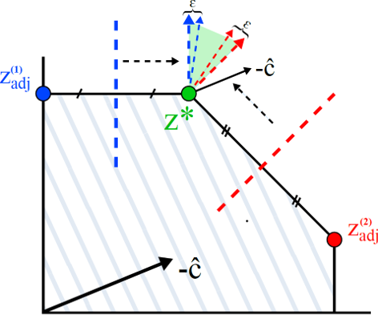

# Solver Free Decision-Focused Learning for Linear Optimization Problems

<p align="center"></p>

## Repository Structure
This repository contains the code accompanying our NeurIPS 2025 paper on Solver-Free Decision-Focused Learning for Linear Optimization Problems.
The repository contains all data generators, loss functions, and experiment scripts used in the paper.

- `experiments/` – main experiment script, along with configuration files used in the paper.
- `architectures/` – PyTorch models used to predict cost predictions.
- `data/` – data generators, including code for precomputation of adjacent vertices.
- `methods/` – implementations of losses not included in PyEPO (LAVA and CaVE).
- `optimization_problems/` – Gurobi implementations of random LP, shortest path, and knapsack instances.
- `utils/` – training utilities, regret computation and helper functions.
- `plotting/` – scripts for visualizing regret/time curves for each method.

## Requirements
This project depends on the following requirements. The listed version numbers were used in our experiments,
but other versions may also work. We used Python 3.13 in our experiments.
- `torch==2.8.0`
- `pyepo==1.0.2`
- `cvxpy==1.7.3`
- `gurobipy==12.0.3`
- `numpy==2.3.5`
- `scipy==1.16.3`
- `scikit_learn==1.7.2`
- `matplotlib==3.10.7`
- `tqdm==4.67.1`
- `pathos==0.3.4`

## Running Experiments
Every experiment is driven by a JSON config that specifies:
- `benchmark`: one of `random_lp`, `shortest_path`, `knapsack`, `california_house_price_knapsack`.
- Data/learning parameters (`num_data`, `num_feat`, `deg`, `e`, `batch_size`, `num_epochs`, etc.).
- Solver/model parameters (`num_vars`, `num_constrs`, `model`, etc.).
- `experiments`: list of method dictionaries, e.g., `{ "name": "LAVA", "method": "lava", "learning_rate": 0.001, "hyperparameters": {"threshold": -0.1} }`.
- `seeds`: list of random seeds for repeated runs.

Example usage:
```bash
cd experiments
python main_experiment.py --config configs/first_experiment/config_random_lp.json
```

Outputs:
- `results/<timestamp>/config.json` – the config that was executed.
- `results/<timestamp>/results.json` – train/val/test regret arrays and wall-clock training times.
- `results/<timestamp>/plots/*.png` – figures generated by `plotting/plot_results.py`.

Adjust `--config` to point to any file under `experiments/configs/**`.


## Citation
**Cite as:**

```
@article{berden2025solver,
  title={Solver-Free Decision-Focused Learning for Linear Optimization Problems},
  author={Berden, Senne and Mahmuto{\u{g}}ullar{\i}, Ali {\.I}rfan and Tsouros, Dimos and Guns, Tias},
  journal={arXiv preprint arXiv:2505.22224},
  year={2025}
}
```

## Contact
For any questions or issues, please contact Senne Berden (senne.berden@kuleuven.be) or open an issue in this repository.